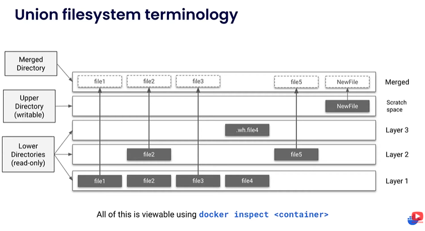
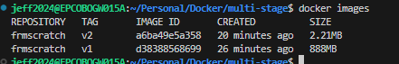

# Multi-Stage Docker Builds

This example demonstrates the benefits of multi-stage Docker builds by comparing single-stage and multi-stage builds for a Go application.

## Overview

Multi-stage builds allow you to use multiple `FROM` statements in your Dockerfile. Each `FROM` instruction begins a new stage of the build, and you can selectively copy artifacts from one stage to another, leaving behind everything you don't want in the final image.

## Understanding the image layers 
Each layer in an image contains a set of filesystem changes - additions, deletions, or modifications. That allows you to use the same image for multiple container. 

### Lower Directories 
They are the layers that coming from the image

### Upper Directory
It is a unique writable space specific to the container. 



## Single-Stage Build (Heavy Image)

### Dockerfile Content - Stage 1 Only
```bash
# syntax=docker/dockerfile:1
FROM golang:1.24
WORKDIR /src
COPY ./basicExamples.go .
RUN go build -o /bin/hello ./basicExamples.go
```

### Build Command
```bash
docker build -t frmscratch:v1 -f multiStageFromScratch .
```

**Result**: This creates a large image (~800MB+) because it includes the entire Go runtime and build tools.

## Multi-Stage Build (Lightweight Image)

### Complete Dockerfile with Multi-Stage
```bash
# syntax=docker/dockerfile:1
# Build stage
FROM golang:1.24
WORKDIR /src
COPY ./basicExamples.go .
RUN go build -o /bin/hello ./basicExamples.go

# Production stage
FROM scratch
COPY --from=0 /bin/hello /bin/hello
CMD [ "/bin/hello" ]
```

### Build Command
```bash
docker build -t frmscratch:v2 -f multiStageFromScratch .
```

**Result**: This creates a minimal image (~2MB) containing only the compiled binary.

## Image Size Comparison

When you run both builds, you'll notice a significant difference in image sizes:



The multi-stage build (v2) produces a much smaller image than the single-stage build (v1).

## Key Benefits of Multi-Stage Builds

- **Reduced Image Size**: Final image contains only necessary artifacts
- **Enhanced Security**: Fewer components mean fewer potential vulnerabilities
- **Faster Deployment**: Smaller images deploy and start faster
- **Clean Separation**: Build dependencies don't pollute the runtime environment

## How Multi-Stage Works

1. **Stage 0 (Build)**: Uses `golang:1.24` base image to compile the Go application
2. **Stage 1 (Production)**: Uses `scratch` (empty) base image and copies only the compiled binary
3. **COPY --from=0**: Copies the binary from the first stage to the second stage

## Running the Application

After building either version, you can run the container:

```bash
# Run the single-stage version
docker run frmscratch:v1

# Run the multi-stage version  
docker run frmscratch:v2
```

Both will produce the same output, but v2 will be significantly smaller and more efficient.

## Advanced Multi-Stage Build with Environment Variables

This example demonstrates how to pass environment variables and dynamic data between stages in a multi-stage build.

### Dockerfile Content - Environment Variable Passing
```dockerfile
# syntax=docker/dockerfile:1
ARG BASE_IMAGE=golang:1.24

FROM golang:1.24
WORKDIR /src
COPY ./basicExamples.go .
ENV TEST_ENV_VAR_TEST=HelloWorld
RUN echo "export MYVAR_TEST='$TEST_ENV_VAR_TEST'" > env.sh
RUN TEST_ENV_VAR=$(cat /etc/os-release | grep PRETTY_NAME | cut -d '=' -f2 | tr -d '"') && \
    echo "export MYVAR='$TEST_ENV_VAR'" >> env.sh
RUN cat env.sh
RUN go build -o /bin/hello ./basicExamples.go


# Add a second stage to the Dockerfile
# This stage will copy the environment variable and source it in the final image
FROM ${BASE_IMAGE}
WORKDIR /src
COPY --from=0 /src/env.sh /src/env.sh
COPY /scripts /src
## Copy the compiled binary from the first stage
## you must copy to /etc/environment 
##
## What is the /etc/environment file?
# Before we delve into the how, it’s crucial to understand what the `/etc/environment` file is. It is a system-wide configuration file in Linux that is read upon system boot. This file is utilized to set up environment variables — key-value pairs that can be used by processes in the operating system.
# https://tecadmin.net/etc-environment-file-in-linux/
RUN cat /src/env.sh >> /etc/environment
RUN cat /etc/environment
ENTRYPOINT ["/bin/bash", "-c", "cat /etc/environment && source /etc/environment && bash read_printenv.sh "]


```

### Build Commands
```bash
# Build with default Ubuntu base image
docker build -t env-passing:v1 -f multiStagePassingVars .

# Build with custom base image using build argument
docker build --build-arg BASE_IMAGE=alpine:latest -t env-passing:v2 -f multiStagePassingVars .
```

### Key Features of This Example

- **Build Arguments**: Uses `ARG BASE_IMAGE` to make the base image configurable
- **Environment Variables**: Passes both static (`HelloWorld`) and dynamic (OS info) variables between stages
- **Stage Naming**: Uses `AS builder` to name the first stage for clarity
- **Script Integration**: Copies and executes external scripts in the final image
- **Environment Setup**: Properly configures environment variables in `/etc/environment`

### Running the Advanced Example

```bash
# Run and see environment variables in action
docker run env-passing:v1

# Run interactively to debug
docker run -it env-passing:v1 /bin/bash

# Check the environment file contents
docker run env-passing:v1 cat /etc/environment
```

### Expected Output

The container will display:
1. The contents of `/etc/environment`
2. Loaded environment variables (MYVAR_TEST and MYVAR)
3. Output from the `read_printenv.sh` script
4. Any output from the Go application

This demonstrates how multi-stage builds can be used not just for size optimization, but also for complex environment setup and data passing between build stages.

## Comparison Summary

| Build Type | Use Case | Image Size | Complexity | Best For |
|------------|----------|------------|------------|----------|
| Single-Stage | Simple builds | Large (~800MB) | Low | Development |
| Multi-Stage (Scratch) | Minimal production | Tiny (~2MB) | Medium | Production |
| Multi-Stage (Env Vars) | Complex setup | Medium (~100MB) | High | Enterprise |

Choose the approach that best fits your application's requirements for size, functionality, and deployment complexity.