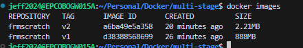

# Multi-Stage Docker Builds

This example demonstrates the benefits of multi-stage Docker builds by comparing single-stage and multi-stage builds for a Go application.

## Overview

Multi-stage builds allow you to use multiple `FROM` statements in your Dockerfile. Each `FROM` instruction begins a new stage of the build, and you can selectively copy artifacts from one stage to another, leaving behind everything you don't want in the final image.

## Single-Stage Build (Heavy Image)

### Dockerfile Content - Stage 1 Only
```bash
# syntax=docker/dockerfile:1
FROM golang:1.24
WORKDIR /src
COPY ./basicExamples.go .
RUN go build -o /bin/hello ./basicExamples.go
```

### Build Command
```bash
docker build -t frmscratch:v1 -f multiStageFromScratch .
```

**Result**: This creates a large image (~800MB+) because it includes the entire Go runtime and build tools.

## Multi-Stage Build (Lightweight Image)

### Complete Dockerfile with Multi-Stage
```bash
# syntax=docker/dockerfile:1
# Build stage
FROM golang:1.24
WORKDIR /src
COPY ./basicExamples.go .
RUN go build -o /bin/hello ./basicExamples.go

# Production stage
FROM scratch
COPY --from=0 /bin/hello /bin/hello
CMD [ "/bin/hello" ]
```

### Build Command
```bash
docker build -t frmscratch:v2 -f multiStageFromScratch .
```

**Result**: This creates a minimal image (~2MB) containing only the compiled binary.

## Image Size Comparison

When you run both builds, you'll notice a significant difference in image sizes:



The multi-stage build (v2) produces a much smaller image than the single-stage build (v1).

## Key Benefits of Multi-Stage Builds

- **Reduced Image Size**: Final image contains only necessary artifacts
- **Enhanced Security**: Fewer components mean fewer potential vulnerabilities
- **Faster Deployment**: Smaller images deploy and start faster
- **Clean Separation**: Build dependencies don't pollute the runtime environment

## How Multi-Stage Works

1. **Stage 0 (Build)**: Uses `golang:1.24` base image to compile the Go application
2. **Stage 1 (Production)**: Uses `scratch` (empty) base image and copies only the compiled binary
3. **COPY --from=0**: Copies the binary from the first stage to the second stage

## Running the Application

After building either version, you can run the container:

```bash
# Run the single-stage version
docker run frmscratch:v1

# Run the multi-stage version  
docker run frmscratch:v2
```

Both will produce the same output, but v2 will be significantly smaller and more efficient.